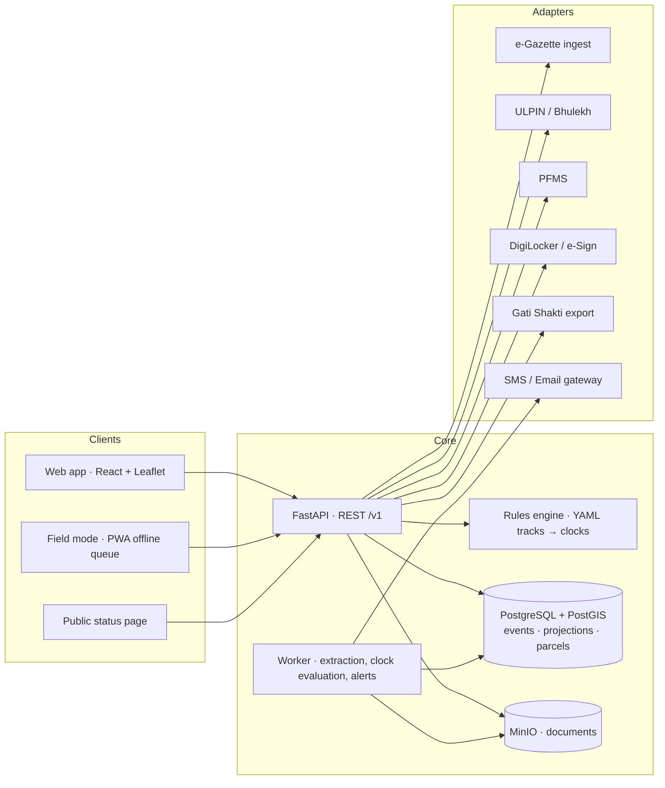

# BhuArjan — National Land Acquisition & Management System

**Problem statement:** SIH26016 · Ministry of Rural Development, Department of Land Resources (DoLR) · Software
**Working name:** BhuArjan (भू-अर्जन). Placeholder — replace once the team decides.
**Status of this document:** product definition for the SIH 2026 build. Everything marked *(verify)* must be checked against the bare Act, the SIH portal, or the SPOC before it goes on a slide.

---

## 1. One line

A national system of record for land acquisition under the RFCTLARR Act 2013 and the Fourth Schedule acts — every stage, every statutory clock, every rupee, every affected family — built as an append-only ledger in which the documents themselves are the events.

## 2. The problem as DoLR experiences it

- Acquisition runs on paper files and state-specific processes. The only national digital system, Bhoomi Rashi, covers National Highways alone.
- Nobody at the centre can see, today, the area notified vs acquired, compensation assessed vs paid, possession, or R&R progress across sectors and states without asking for a report.
- Statutory clocks get missed silently: the s.11 notification is deemed rescinded if the s.19 declaration is late (s.19(7)); the whole proceeding lapses if the award is late (s.25); delayed compensation accrues 12% interest (s.30(3)); lapsed cases restart from zero and invite litigation.
- R&R — the part of the Act that touches families — has no family-level tracking anywhere.

## 3. Positioning against Bhoomi Rashi (the question every judge will ask)

| | Bhoomi Rashi (MoRTH, 2018) | BhuArjan |
|---|---|---|
| Statutes | NH Act 1956 (3A/3D/3G) only | RFCTLARR 2013 + Fourth Schedule tracks (NH, Railways, Metro, Coal Bearing Areas…) as configurable rule-sets |
| Requiring bodies | NHAI / NHIDCL / State PWDs | Any central ministry, state, PSU, ULB |
| Statutory clocks | Not exposed | First-class objects with alerts and lapse consequences |
| R&R / families | Not tracked | Entitlement-level tracking per affected family (PII-protected) |
| Audit | Application logs | Hash-chained, append-only event ledger; every figure on every dashboard traceable to an event and a document |
| GIS | Village lists | Parcel polygons (PostGIS), ULPIN-keyed, exportable to PM Gati Shakti |
| Data entry | Officers type notifications | Officers upload the document; the system extracts and they confirm |
| National view | NH only | Cross-sector: project → district → state → national |

The sentence: *"Bhoomi Rashi proved the category — after MoRTH digitized NH acquisition, notifications went from roughly 1,000 a year to 2,842 in the first year. DoLR has no equivalent for everything else. BhuArjan is that equivalent."*

## 4. Users and roles

| Role | Jurisdiction | Key actions |
|---|---|---|
| Requiring Body (RB) user | Own projects | Submit proposal, deposit cost (s.19(2)), view progress |
| Land Acquisition Officer / Competent Authority (LAO/CALA) | District cases assigned | Record statutory events, upload documents, assess compensation, record possession |
| District Collector | District | Approve awards (s.23), R&R award (s.31), possession (s.38), extensions requests |
| Administrator R&R / Commissioner R&R | State | R&R scheme (ss.16–18), entitlement tracking |
| State Revenue Department | State | Scrutiny, s.19 declaration workflow, extensions, state rule configuration |
| Central Ministry (DoLR / sectoral) | National | Dashboards, MIS, policy reports, escalations |
| Auditor | Read-only | Ledger, documents, audit trail |
| Citizen / landowner | Public | Status by ULPIN / survey number, no PII |
| System admin | — | Users, roles, rule-set versions, integrations |

## 5. Modules

| # | Module | What it does | MVP (20 Sept) | v1 (finale) |
|---|---|---|---|---|
| A | Project & proposal workflow | Proposal → scrutiny → approval; sanctioned cost; RB linkage | Minimal | Full |
| B | Statutory state machine + clocks | Rule-sets as data (YAML): stages, allowed transitions, clocks, extensions, suspensions, lapse consequences | RFCTLARR + NH Act | + Railways/Metro stubs, state variants |
| C | Event ledger + documents-as-events | Upload PDF → LLM/regex extraction → officer confirms → immutable event with document hash | Yes | + versioning UI, bulk ingest |
| D | Parcels & GIS | PostGIS polygons; import GeoJSON/KML/SHP; ULPIN key; area from geometry; Leaflet map | Basic | + village boundaries, Gati Shakti export, WMS |
| E | Compensation & payments | First Schedule computation; award lines per parcel/owner; PFMS payment references; assessed vs paid | Basic | + arbitration/reference (s.64) tracking |
| F | R&R & affected families | Second/Third Schedule entitlement heads per family; delivery status; timelines from s.38 | — | Yes |
| G | Alerts & notifications | Clock thresholds (amber 75%, red 90%, breached); escalation ladder LAO → Collector → State → Ministry | Basic (in-app) | + SMS/email gateway adapter |
| H | Dashboards & MIS | The PS's KPI list at national/state/district/project; drill-down; export | National + project | + district, trend, comparative, custom reports |
| I | Public status | Lookup by ULPIN / survey no.; stage + dates, no PII | — | Yes |
| J | Integration adapters | ULPIN/Bhulekh, PFMS, e-Gazette, DigiLocker/e-Sign, Gati Shakti — real interfaces, mock connectors | e-Gazette ingest only | All adapters (mock) |
| K | Admin & security | RBAC, hash-chained audit, PII encryption, DPDP consent flags, rule-set versioning | Basic | Full |
| L | Timeline-risk score | Rule-based per case (elapsed fraction per clock, objection load, payment lag, litigation flag) | — | Yes; states plainly that ML needs history (26017's problem) |

**Non-goals:** valuing land (market value inputs come from the Collector's process); adjudicating disputes; replacing state land-record systems; blockchain of any kind; predicting delays with ML on synthetic data.

## 6. The demo narrative (90 seconds, one real project)

1. Open a real NH project seeded from actual e-Gazette 3A notifications (villages, survey numbers, area).
2. Upload the 3D declaration PDF → extraction shows fields with confidence → officer confirms → event committed; the clock panel updates: 3A→3D clock closed at day 340 of 365.
3. Award clock starts. Fast-forward the demo date: amber at 75%, red at 90%; alert escalates to the Collector; officer records an extension *or* the award — the system shows the s.25 consequence if neither happens.
4. Award recorded → compensation lines computed → PFMS payment references posted → "assessed vs paid" moves → possession recorded (s.38 blocks possession until payment is complete).
5. Scroll the ledger: every step, who, when, which document, hash.
6. National dashboard tile updates; drill to district; open the public status page for one survey number — stage and dates, no names.

## 7. Architecture overview

Deployable as Docker Compose today; nothing in it MeghRaj cannot host.

## 8. KPIs the system reports (verbatim from the PS, so judges can tick them)

Land proposed and acquired · Notifications issued · Awards declared · Compensation assessed and disbursed · Possession status · R&R progress · Number of affected and displaced families · Project-wise and state-wise progress · Timeline monitoring and milestone tracking · Timeline adherence.

Each KPI is a projection over the event ledger, so every number is traceable to events and documents.

## 9. What "winning" looks like at each gate

- **Internal round:** a live case walked from notification to award with clocks running; the Bhoomi Rashi table; one screenshot per slide.
- **Portal screening (PDF only):** the screener sees a real prototype, a one-line distinct positioning, and feasibility with named risks — in 90 seconds.
- **Finale:** every statute question answered from the running system, not from slides; real seeded data; hash-chained audit shown live; demo runs on localhost with no network; a short technical document handed over.

## 10. Delivery plan

| When | Deliverable |
|---|---|
| Sept 1–3 | SPOC: internal date, template, deadline (portal pages say 20 Sept; guides say 30 Sept — *verify*); start reading the Act + Rules; scrape 50 gazette notifications |
| Sept 4–7 | Schema, event ledger, RFCTLARR + NH rule-sets, clock engine with tests |
| Sept 8–12 | Case page (timeline, ledger, documents), extraction review flow, national dashboard skeleton, parcel import + map |
| Sept 13–15 | Seed one real project end to end; 90-second video; 6-slide PDF |
| Sept 16–18 | Internal round; fixes; submit via SPOC before the deadline |
| Oct | Modules F, I, J adapters, district dashboard, reports, Hindi i18n, field mode |
| Nov | Hardening, technical document, rehearsals, offline demo build, backup video |
| Dec | Finale |

## 11. Team roles (6)

1. Backend — ledger, rules engine, clocks (owns Backend.md)
2. Backend — documents, extraction, integrations (owns APIs.md)
3. Frontend — case page, ledger, extraction review, map
4. Frontend — dashboards, reports, public page, i18n
5. Domain & data — reads the Act and Rules, encodes tracks, scrapes gazette, seeds data, answers statute questions on stage
6. Product & pitch — PPT, video, technical document, demo script, rehearsal (owns pptx.md, Transcript.md)

## 12. Risks

| Risk | Mitigation |
|---|---|
| Team builds a generic admin template | Every feature must cite a section of the Act or a KPI from the PS; delete anything that can't |
| State process variation | Rule-sets are data, versioned per state; demonstrate one state amendment as a config diff |
| Officers won't type data | Document-first ingestion; extraction + confirm is faster than typing |
| Integration APIs unavailable | Adapter layer with mock connectors behind real interfaces; standards-based (REST, GeoJSON, ULPIN) |
| DPDP / PII of families | Field-level encryption, role-scoped access, PII-read audit, public page without names |
| Synthetic-data smell | Seed from real e-Gazette notifications and Bhoomi Rashi public data; label anything synthetic |
| Demo network failure | Everything runs on one laptop; recorded backup |
| Statute misquoted on stage | Domain owner verifies every cited section against the bare Act; keep a section index in Key-Points.md |
